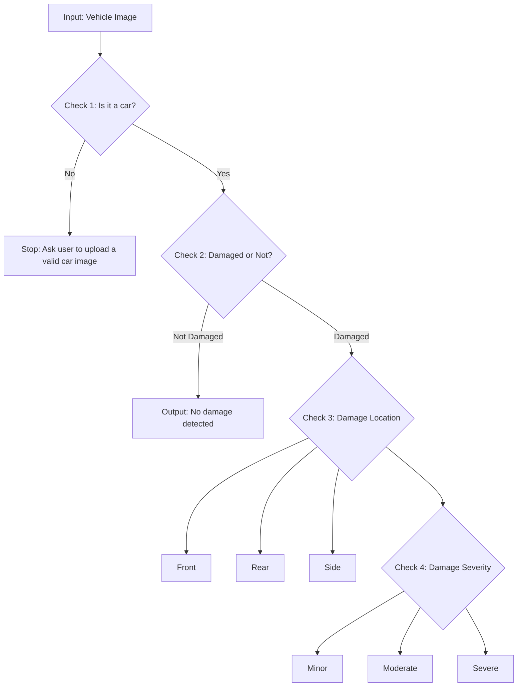

# Auto Car Damage Detection using CNN (VGG16 Transfer Learning)

A solo computer vision project that automates **vehicle damage assessment** from a single image using a **multi-stage AI pipeline**.  
It is designed as a **decision-support prototype** for insurance-style triage workflows, helping classify:

- ✅ Whether the image contains a **car**
- ✅ Whether the car is **damaged**
- ✅ Where the damage is (**Front / Rear / Side**)
- ✅ How severe the damage is (**Minor / Moderate / Severe**)

> **Goal:** Convert a raw image into structured, actionable labels that can support faster claim triage and consistent reporting.

---

## Table of Contents
- [Business Context](#business-context)
- [Key Results](#key-results)
- [Quick Demo](#quick-demo)
- [Pipeline Overview](#pipeline-overview)
- [Methodology (High-Level)](#methodology-high-level)
- [Project Structure](#project-structure)
- [Setup](#setup)
- [How to Run](#how-to-run)
- [Dataset (Not Included)](#dataset-not-included)
- [Handling Limited Data](#handling-limited-data)
- [Evaluation Visuals](#evaluation-visuals)
- [Limitations & Future Improvements](#limitations--future-improvements)
- [Contact](#contact)

---

## Business Context

In many insurance claim processes, assessing vehicle damage is **manual**, time-consuming, and inconsistent across different reviewers.  
This project demonstrates how AI can assist with **initial triage** by answering four practical questions from a photo:

1. *Is this image actually a car?*  
2. *Is the car damaged?*  
3. *Where is the damage located?*  
4. *How severe does the damage appear?*

This kind of structure can reduce back-and-forth, improve documentation quality, and support quicker routing of claims.

> ⚠️ This is a prototype for **decision support**, not a replacement for professional assessment in high-risk cases.

---

## Key Results

| Stage | Task | Classes | Accuracy |
|------:|------|---------|---------:|
| Check 2 | Damage Detection | Damaged / Not Damaged | **90.2%** |
| Check 3 | Damage Location | Front / Rear / Side | **73.9%** |
| Check 4 | Damage Severity | Minor / Moderate / Severe | **68.8%** |

---

## Quick Demo

#### Example Output — Check 1 (Car Validation)

#### Example Output — Check 2 (Damaged vs Not Damaged)

#### Example Output — Check 3 (Front / Rear / Side)

#### Example Output — Check 4 (Minor / Moderate / Severe)

#### Optional: End-to-End Demo GIF (Best for Recruiters)

---

## Pipeline Overview

This project follows a **gated decision workflow**, similar to a real claim intake process:

- If the image is not a car → stop early
- If the car is not damaged → stop early
- If damaged → predict location and severity

## Methodology

Instead of training a full CNN end-to-end, the pipeline does:

1. Feature Extraction: VGG16 acts like a “visual feature generator” (edges, textures, shapes).
2. Lightweight Classification: A Logistic Regression classifier is trained on those extracted features.

### What this achieves

- Faster training
- Reduced overfitting risk compared to training a full CNN
- Practical performance with limited labelled data
