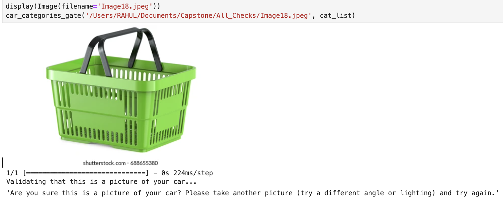
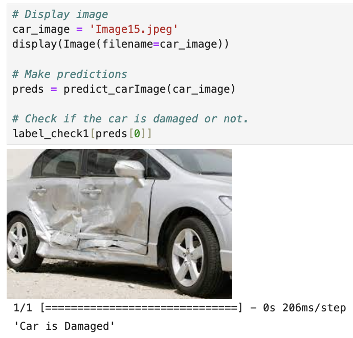
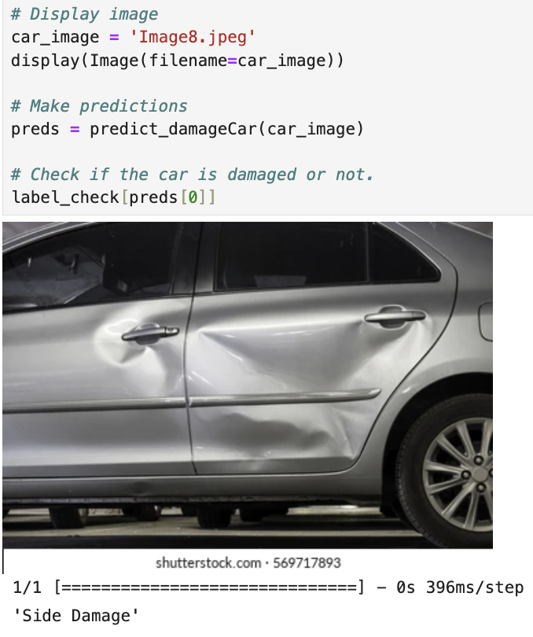
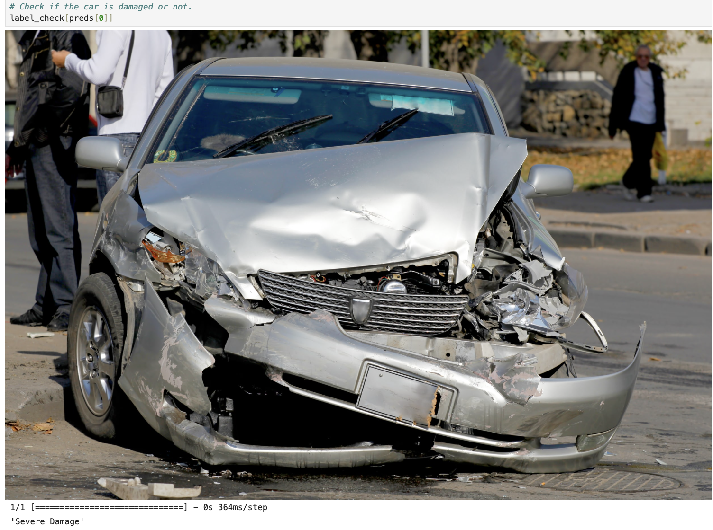
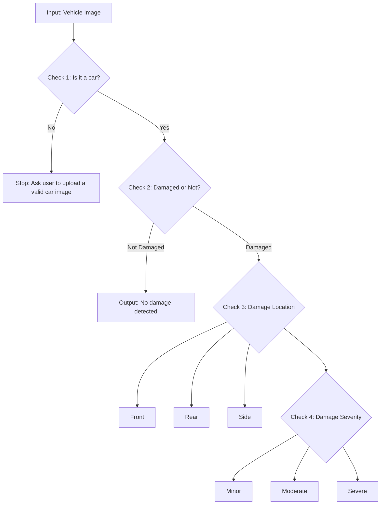
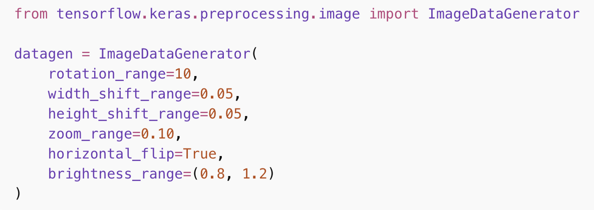
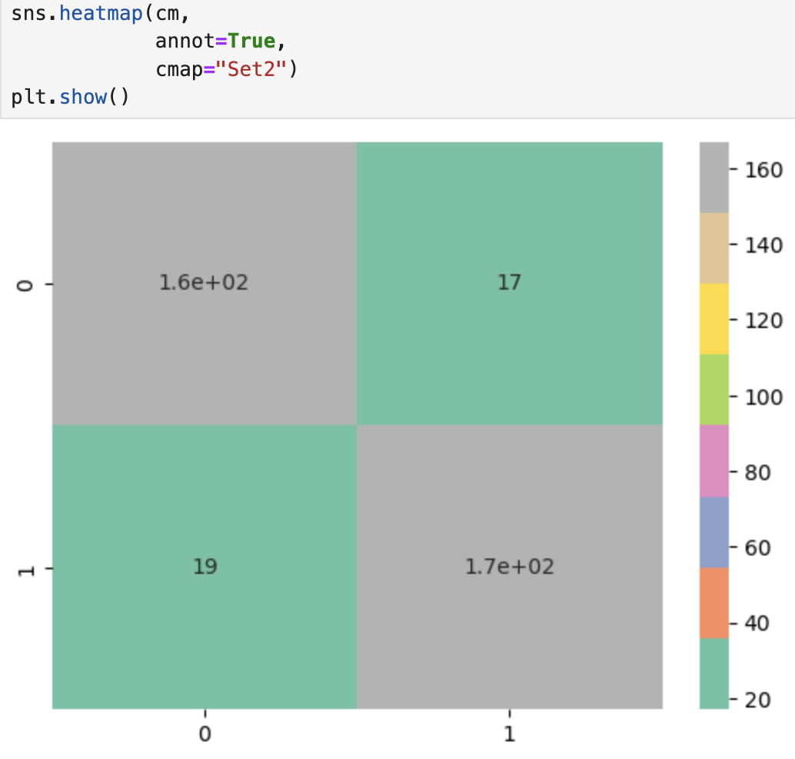
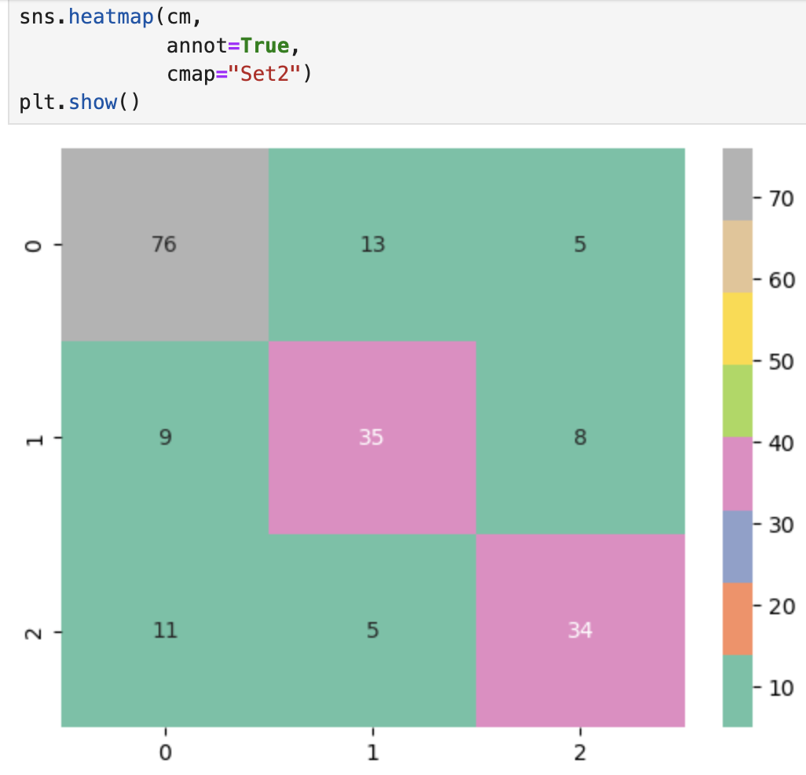
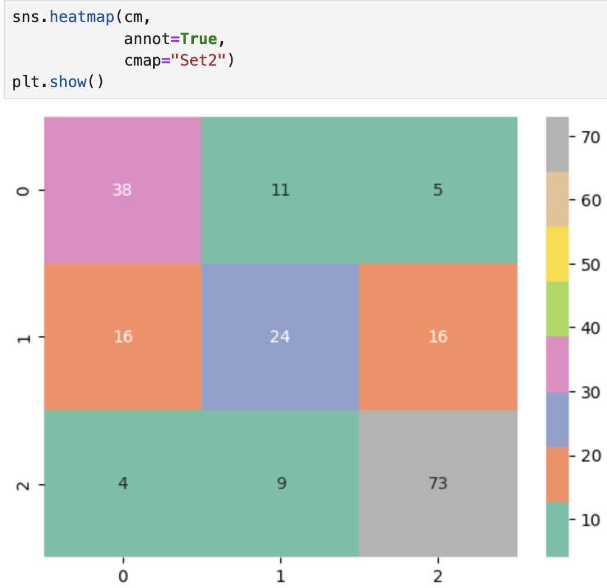

# Auto Car Damage Detection using CNN (VGG16 Transfer Learning)

A solo computer vision project that automates **vehicle damage assessment** from a single image using a **multi-stage AI pipeline**.  
It is designed as a **decision-support prototype** for insurance-style triage workflows, helping classify:

- ✅ Whether the image contains a **car**
- ✅ Whether the car is **damaged**
- ✅ Where the damage is (**Front / Rear / Side**)
- ✅ How severe the damage is (**Minor / Moderate / Severe**)

> **Goal:** Convert a raw image into structured, actionable labels that can support faster claim triage and consistent reporting.

---

## Table of Contents
- [Business Context](#business-context)
- [Key Results](#key-results)
- [Quick Demo](#quick-demo)
- [Pipeline Overview](#pipeline-overview)
- [Methodology](#methodology)
- [Project Structure](#project-structure)
- [Setup](#setup)
- [How to Run](#how-to-run)
- [Dataset (Not Included)](#dataset-not-included)
- [Handling Limited Data](#handling-limited-data)
- [Evaluation Visuals](#evaluation-visuals)
- [Limitations & Future Improvements](#limitations--future-improvements)

---

## Business Context

In many insurance claim processes, assessing vehicle damage is **manual**, time-consuming, and inconsistent across different reviewers.  
This project demonstrates how AI can assist with **initial triage** by answering four practical questions from a photo:

1. *Is this image actually a car?*  
2. *Is the car damaged?*  
3. *Where is the damage located?*  
4. *How severe does the damage appear?*

This kind of structure can reduce back-and-forth, improve documentation quality, and support quicker routing of claims.

> ⚠️ This is a prototype for **decision support**, not a replacement for professional assessment in high-risk cases.

---

## Key Results

| Stage | Task | Classes | Accuracy |
|------:|------|---------|---------:|
| Check 2 | Damage Detection | Damaged / Not Damaged | **90.2%** |
| Check 3 | Damage Location | Front / Rear / Side | **73.9%** |
| Check 4 | Damage Severity | Minor / Moderate / Severe | **68.8%** |

---

## Quick Demo

#### Example Output — Check 1 (Car Validation)


#### Example Output — Check 2 (Damaged vs Not Damaged)


#### Example Output — Check 3 (Front / Rear / Side)


#### Example Output — Check 4 (Minor / Moderate / Severe)


---

## Pipeline Overview

This project follows a **gated decision workflow**, similar to a real claim intake process:

- If the image is not a car → stop early
- If the car is not damaged → stop early
- If damaged → predict location and severity


---

## Methodology

Instead of training a full CNN end-to-end, the pipeline does:

1. Feature Extraction: VGG16 acts like a “visual feature generator” (edges, textures, shapes).
2. Lightweight Classification: A Logistic Regression classifier is trained on those extracted features.

#### What this achieves

- Faster training
- Reduced overfitting risk compared to training a full CNN
- Practical performance with limited labelled data

---

## Project Structure

This repository includes:

- .ipynb notebooks for each check (training and inference)
- Saved artifacts (e.g., .pkl, .h5, .yml) needed for running prediction
- No dataset (due to size + redistribution constraints)

### Setup

If your repo includes environment.yml, use Conda:
```bash
conda env create -f environment.yml
conda activate <your-env-name>
```

If you’re using pip instead:
```bash
pip install -r requirements.txt
```

### How to Run

Because the dataset isn’t included, the fastest way to see results is to run prediction notebooks.

#### Recommended run order (demo-focused)

1. **Check 1 — Car or Not**: first check - car or not - 1.ipynb
2. **Check 2 — Damaged or Not**: Second Check - Prediction Time.ipynb
3. **Check 3 — Location (Front/Rear/Side)**: Third Check - Prediction time.ipynb
4. **Check 4 — Severity (Minor/Moderate/Severe)**: Fourth Check - Prediction time.ipynb

In each prediction notebook, replace the image path with your own image to test quickly.

#### Training notebooks (if dataset is available)

Each stage typically includes:

- feature extraction notebook
- “Creating Logistic” notebook (training the classifier)

## Dataset (Not Included)

The dataset is not uploaded to GitHub because:
- it exceeds GitHub size constraints, and
- the images were curated from publicly available sources that may have redistribution restrictions.

**Dataset summary used during development**
- 900+ labelled vehicle images
- structured into folder-based classes
- split 80/20 train/test per stage

### Folder structures expected

- **Check 2 — Damage vs Whole:**
  data1a/
  training/
    damaged/
    whole/
  validation/
    damaged/
    whole/
- **Check 3 — Front / Rear / Side:**
    data2a/
  training/
    front/
    rear/
    side/
  validation/
    front/
    rear/
    side/
- **Check 4 — Minor / Moderate / Severe:**
  data3a/
  training/
    minor/
    moderate/
    severe/
  validation/
    minor/
    moderate/
    severe/

This repo is still reproducible because the pipeline and artifacts are included, and the dataset structure is documented clearly.

---

## Handling Limited Data

This project addresses smaller datasets primarily through:

- Transfer learning (VGG16 pretrained on ImageNet)
- Feature extraction + Logistic Regression, which is stable and efficient on limited data

**Basic Data Augmentation (recommended for re-training):** If someone retrains this pipeline, they can improve robustness using basic augmentation (rotations, flips, zoom, brightness).

#### Example augmentation (Keras):


* Augmentation is a common technique to reduce overfitting and improve generalization when images are limited or biased in angle/lighting.

---

## Evaluation Visuals

#### Check 2 — Damage vs Not Damage


#### Check 3 — Location (Front/Rear/Side)


#### Check 4 — Severity (Minor/Moderate/Severe)


--- 

## Limitations & Future Improvements

- Improve severity prediction using more diverse training images and clearer severity labelling
- Fine-tune VGG16 layers (instead of only feature extraction) to improve generalization
- Train a single multi-head model to predict location + severity jointly
- Add a lightweight web interface for claim upload and results visualization
- Add calibration and confidence thresholds for safer decision support
